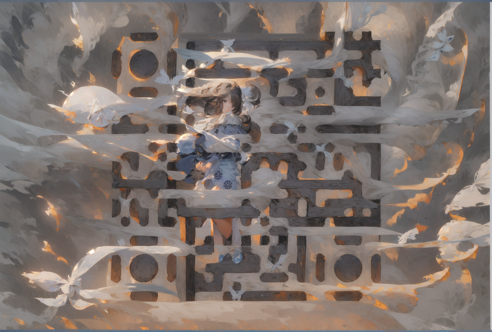

import qrSnow from './qr-snow-village.png';
import qrAnime from './qr-anime.png';

What if your brand's QR code wasn't a black-and-white grid — but a painting?

That's the premise behind AI-generated QR codes using Stable Diffusion. The result is a scannable code embedded inside artwork so seamlessly that the QR structure only reveals itself to a camera, not the human eye.

## How ControlNet Makes It Possible

Standard Stable Diffusion generates images from prompts. ControlNet adds a structural layer — it conditions the generation on an input map (depth, edges, poses, or in this case, a QR code pattern) while still following the creative prompt.

The process looks like this:

1. **Generate a standard QR code** for your URL
2. **Feed it to ControlNet** as a conditioning image, with a high control weight so the structure is preserved
3. **Write a creative prompt** — a snowy village, an abstract painting, a fantasy landscape
4. **Tune the balance** between prompt fidelity and QR accuracy until both work

The magic is in step 4. Too much control weight and you get a textured QR code that looks like a QR code. Too little and you get beautiful art that doesn't scan. The sweet spot — typically a control weight between 0.7–0.9 with a guidance scale around 7–9 — is where the results look like the image below.

## What Model Settings Matter

These parameters consistently produce the best scan rates:

| Parameter | Recommended Range |
|---|---|
| ControlNet weight | 0.75 – 0.90 |
| Guidance scale (CFG) | 7 – 9 |
| Steps | 30 – 50 |
| Sampler | DPM++ 2M Karras |
| ControlNet module | brightness / tile |

The `brightness` ControlNet module works better than `canny` for QR codes because QR codes rely on contrast regions, not edges.

## Scanning Reliability

Not all generated QR codes scan reliably. A few things that help:

- **High contrast prompt words** — "dark wood", "snow", "black ink on white paper" — steer the model toward the contrast the QR reader needs
- **Test at multiple scales** — codes that scan from your phone at arm's length may fail when printed small
- **Error correction level H** — use the highest QR error correction level when generating the source code; it gives the model more latitude to distort the pattern without breaking it

## Why This Is More Than a Gimmick

QR codes are friction. People hesitate to scan something that looks like spam. An AI-generated QR code embedded in compelling artwork changes that calculus — it invites curiosity rather than suspicion.

For brand activations, event signage, or product packaging, a QR code that doubles as artwork is a conversation starter. The scan is incidental to the visual.

---

Interested in applying generative AI techniques to your brand's creative work? [Get in touch](#contact) — this is exactly the kind of experiment we love to run.
